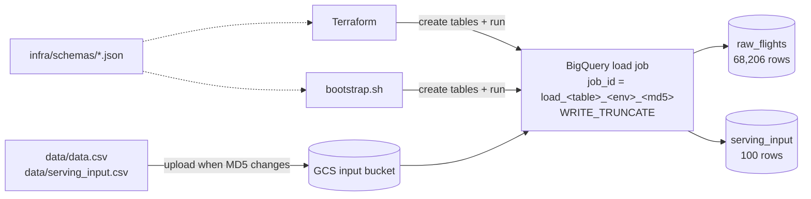
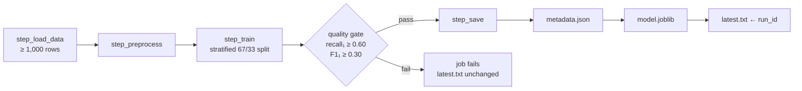
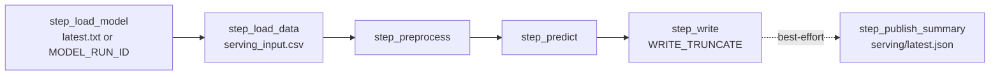
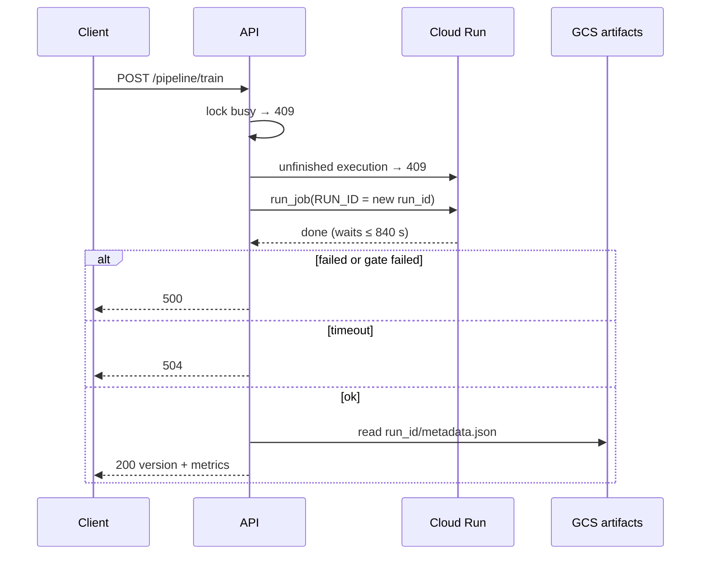
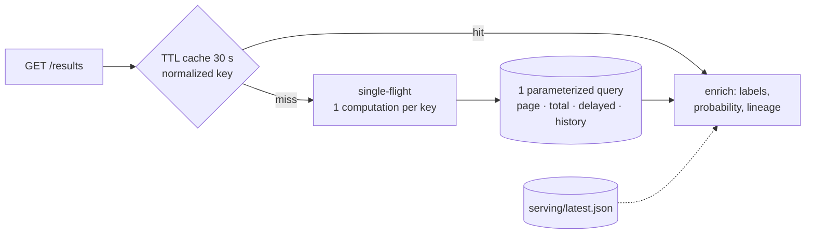
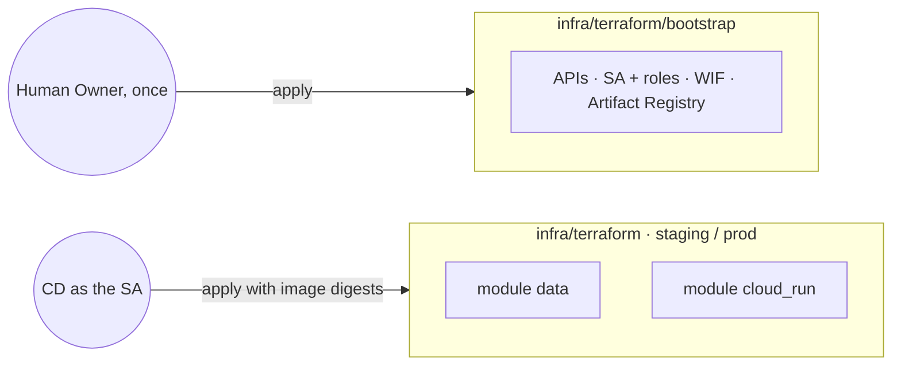
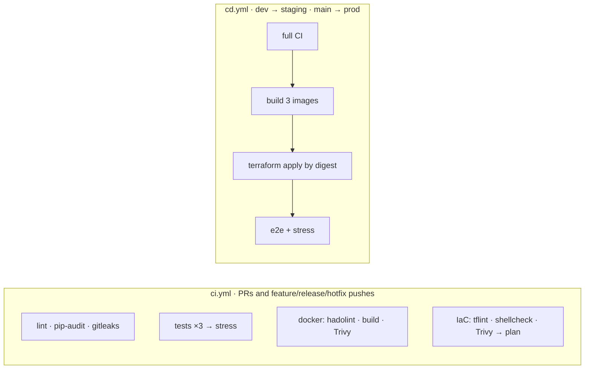
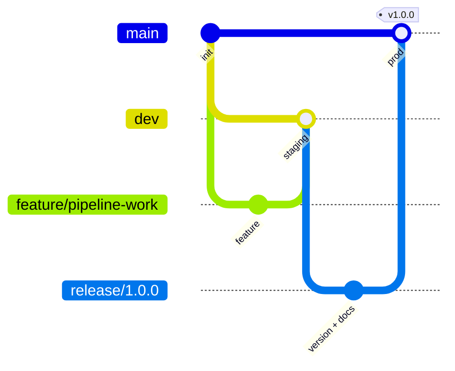
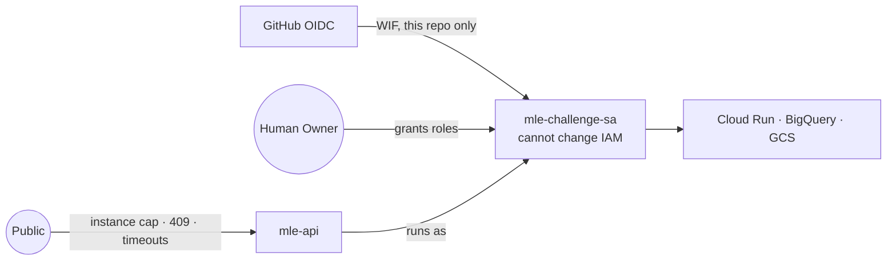

# LATAM ML Tech Challenge — Flight Delay Prediction on GCP

Productionizes `challenge/exploration.ipynb` on GCP: `DelayModel`, data in GCS and BigQuery, training and batch-serving Cloud Run Jobs, a FastAPI control plane, Terraform plus `bootstrap.sh`, and GitHub Actions CI/CD.

| | |
|---|---|
| **API** | prod `https://mle-api-prod-wr36ajzmgq-uc.a.run.app` · staging `https://mle-api-staging-wr36ajzmgq-uc.a.run.app` (scales to zero) · docs at `/docs` |
| **Model** | Balanced XGBoost, 10 features · holdout recall₁ 0.688, F1₁ 0.364 |
| **Infra** | `us-central1`: Cloud Run (service + 2 jobs), BigQuery, GCS, Artifact Registry · Terraform + equivalent `infra/bootstrap.sh` |
| **CI/CD** | GitHub Actions with keyless WIF · `dev` → staging, `main` → prod · e2e and stress test after each deploy |
| **Quality** | 160 tests, 96 % coverage · ruff, pip-audit, gitleaks, hadolint, Trivy, tflint, shellcheck, actionlint |


```bash
API=https://mle-api-prod-wr36ajzmgq-uc.a.run.app
curl -s $API/health
curl -s "$API/pipeline/predict/results?page=1&page_size=5&opera=Grupo%20LATAM,Sky%20Airline&mes=7,12"
curl -s -X POST $API/pipeline/train     # ~2-3 min, returns version + metrics
curl -s -X POST $API/pipeline/predict   # ~2-3 min, returns the first 10 predictions
```

The `POST`s are synchronous, as required. A concurrent `POST` to the same pipeline returns 409.

## Key design decisions

| Decision | Why |
|---|---|
| Balanced XGBoost, `scale_pos_weight` computed in `fit()` | Highest recall |
| `preprocess` always applies `reindex(FEATURES_COLS)` | Same 10 columns in training and serving |
| Explicit BigQuery schemas shared by Terraform and `bootstrap.sh` | Mixed-type columns load correctly |
| Load `job_id` includes the CSV's MD5 | Idempotent reloads |
| Quality gate: recall₁ ≥ 0.60 and F1₁ ≥ 0.30 | A model that misses delays is never promoted |
| Immutable `<run_id>/` artifacts, `latest.txt` written last | Atomic promotion; rollback through `MODEL_RUN_ID` |
| The API injects `RUN_ID` into the training job | Returns the metadata of that exact run |
| Blocking endpoints declared with `def` | The threadpool keeps `/health` and `/results` responsive during a `POST` |
| One run per pipeline (409) | Consistent results |
| One parameterized query + single-flight TTL cache | One BigQuery round trip per page |
| Lineage and probabilities in `serving/latest.json` | A provided test pins the 4-column `predictions` table |
| Two Terraform roots: human bootstrap, CD environment | CI/CD cannot modify IAM |
| WIF instead of keys | The org policy forbids service account keys |
| Deploy by image digest, then e2e against the environment | What runs is what was tested; caught two BigQuery-only bugs |

## Local quickstart

```bash
make install && make model-test && make lint   # no GCP credentials needed (DEPLOYMENT_MODE=local)
make training-local && make serving-local      # writes artifacts/<run_id>/ and artifacts/predictions.csv
```

## Part I — Model

68,206 SCL flights from 2017. `delay = 1` when a flight leaves more than 15 min late; 18.5 % are delayed (≈ 4.4 : 1).

**Notebook bugs**

| Issue | Status |
|---|---|
| Train/serve skew: `get_dummies` on whatever data is present | **Fixed:** `reindex(FEATURES_COLS, fill_value=0)` |
| Row-wise `get_min_diff`; global warning filter hides a `DtypeWarning` | **Fixed:** vectorized `compute_delay`, `low_memory=False` |
| `get_period_day` strict bounds: 1,230 rows get `None` | Documented (feature unused) |
| `is_high_season` compares datetimes with midnight: 730 rows misclassified | Documented (feature unused) |
| `get_rate_from_column` computes `total / delays` | Documented (rate charts inverted) |
| Positional `sns.barplot(x, y)` fails since seaborn 0.12 | Documented |
| Order-dependent labels, dead code (`shuffle`, `> 0.5` on `predict()`) | Not replicated |


## Part II — Data infrastructure



| Resource (prod) | Contents |
|---|---|
| `latam-mle-dzapata-mle-input-prod` | CSVs|
| `latam-mle-dzapata-mle-artifacts-prod` | Models, `latest.txt`, `serving/latest.json` |
| `mle_challenge_prod` | `raw_flights`, `serving_input`, `predictions` |

- `Vlo-I`/`Vlo-O` are `STRING` and `Fecha-*` are `DATETIME`. Original names (`Fecha-I`, `AÑO`) are kept through flexible column names.
- Prod has `deletion_protection` and `force_destroy = false` (staging is disposable).
- One service account (`mle-challenge-sa`) for everything, as required.

## Parts III & IV — Pipelines

Both pipelines are explicit `step_*` functions chained by `main()` and use only `DelayModel` methods. `local` and `gcp` modes differ only in the injected connectors.

**Training** (`challenge/training.py`)



- The saved model is the one evaluated on the holdout, so the published metrics describe the served artifact.
- `metadata.json` records version, `git_sha`, hyperparameters, metrics, gate result, data fingerprint and library versions.
- `run_id` (e.g. `20261002T202458Z-a1a006fe`) is sortable and unique; uploads use `if_generation_match=0`.

Holdout (22,508 flights): recall₁ 0.688 · F1₁ 0.364 · precision₁ 0.248 · ROC-AUC 0.644.

**Serving** (`challenge/serving.py`)



- Fails if no trained model loads, never serves a fallback.
- One prediction per input row.
- Reads the CSV from GCS because the provided tests fix that contract.
- `serving/latest.json` (lineage and per-combination probabilities) is best-effort: a failure only logs a warning.

## Part V — Control API

| Endpoint | Returns | Errors |
|---|---|---|
| `GET /health` | `{"status": "ok"}` | — |
| `POST /pipeline/train` | Version, holdout metrics, `trained_at` | 422 no data · 409 · 500 job or gate failed · 504 |
| `POST /pipeline/predict` | First 10 predictions, total, model version | 422 no model · 409 · 500 · 504 |
| `GET /pipeline/predict/results` | Page plus `summary`, `model`, `links`, and probability and 2017 history per row | 422 invalid params |

Query params: `page`, `page_size` (≤ 100), and comma-separated `opera`, `tipovuelo`, `mes`.





- **Sync without blocking:** `def` endpoints run in the threadpool; `async def` with blocking calls would freeze the server.
- **409:** a per-process lock plus a check for unfinished Cloud Run executions, which covers other instances.
- **Safe SQL:** filters travel as `ArrayQueryParameter`, `maximum_bytes_billed` caps cost, and rows are ordered by `OPERA, TIPOVUELO, MES, prediction` (tied rows are identical).
- **Cache:** per instance, 1,024 entries, invalidated by `POST /pipeline/predict`. Trade-off: other instances may be up to 30 s stale.
- **Additive enrichment:** new fields are nullable, so provided tests and existing clients keep working.

**Stress test** (local, 100 users, 60 s): 289,231 requests, **0 failures**, 4,825 req/s, p99 23 ms. Profiling showed the server was CPU-bound; `uvloop`, `httptools` and no access log gave +49 % throughput in a controlled benchmark. 42 API tests (14 provided + 28 new).

## Part VI — Infrastructure and CI/CD

**Containers.** Three multi-stage images (`api`, `training`, `serving`) share an identical uv `builder` layer. Base image and uv are pinned by digest, the user is non-root (UID 10001), `.dockerignore` is an allowlist, `xgboost-cpu` saves ~300 MB, and `GIT_SHA` is baked in for lineage.

**Terraform**



- **Two roots:** only a human can change IAM, so a compromised workflow cannot escalate privileges.
- **Cloud Run:** API 1 vCPU / 1 GiB, concurrency 80, prod 1–5 instances, staging 0–2; jobs run with 0 retries.
- **Staggered timeouts:** job 600 s < API wait 840 s < request 900 s, so the API can always answer, 504 included.

**`infra/bootstrap.sh`** provisions the same resources with gcloud and bq: same schemas and load `job_id`s, idempotent, `set -Eeuo pipefail`, explicit `--project`, images built in Cloud Build. It was validated from scratch in an empty project (~14 min), and a re-run was a no-op (88 s).

**CI/CD**



- Actions are pinned by SHA with minimal permissions and no secrets; Dependabot keeps them current.
- `terraform plan` on PRs uses the deployed images, so the diff shows only infrastructure changes.
- One deploy per environment at a time. Rollback means re-running the CD on a previous tag.

## GitFlow



`feature/*` → PR to `dev` (staging) → `release/x.y.z` → `main` (prod, tagged); `hotfix/*` branches off `main`. Branches are never deleted. PR #2 was merged into `main` by mistake and left as is, since the same content later reached `dev`.

## Operations

| Situation | Action |
|---|---|
| API errors | `gcloud logging read 'resource.type="cloud_run_revision" AND resource.labels.service_name="mle-api-prod" AND severity>=ERROR' --project=latam-mle-dzapata --limit=20` |
| Current model | `gcloud storage cat gs://latam-mle-dzapata-mle-artifacts-prod/latest.txt` |
| Model rollback | `gcloud run jobs update mle-serving-prod --region=us-central1 --update-env-vars=MODEL_RUN_ID=<run_id>`, then `POST /pipeline/predict` |
| Code rollback | Run the CD workflow on the previous tag |
| Quality gate failed | Nothing: `latest.txt` still points to the previous model |

## Security


